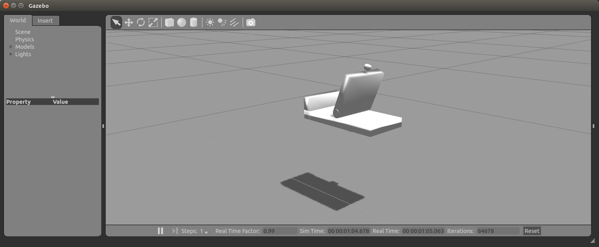
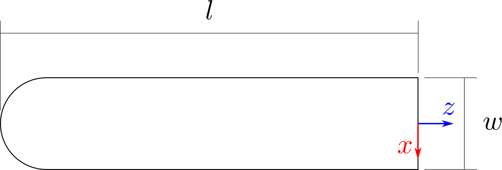
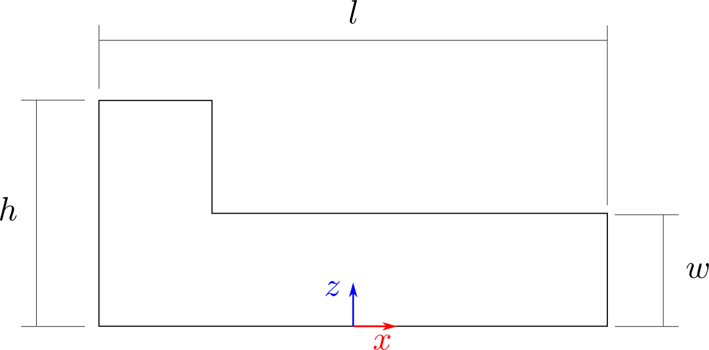

# Planar folding assembly

This package contains everything required to simulate a planar folding assembly operation in Gazebo.
The naming convention used is that the __slider__ object is the one assembled on top of the __receptacle__ object.



The objective of this simulation is to try to replicate the controller described in [this paper][planar_folding_paper], in order to perform a sliding motion and then a folding motion while maintaining the desired contact forces.


## Basic usage

To start the simulation using one of the provided controllers, the simulator with the receptacle object need to be launched first, using

```
roslaunch planar_folding_assembly planar_folding_assembly.launch
```

Once the simluator is up and running, the slider object can be spawned with an argument specifying the controller plugin to be loaded with

```
roslaunch planar_folding_assembly spawn_slider.launch controller:=CONTROLLER_NAME
```

In the `roslaunch` command above, `CONTROLLER_NAME` must correspond to the name of one of the files in [`urdf/controllers`](urdf/controllers), without the `.slider.urdf.xacro` extension.

The reason for forcing the spawning order is that the controller plugin will try to retrieve a pointer to the receptacle object when being loaded, and spawning both at the same time can cause errors due to race conditions.


## Available controllers

A set of controllers has been implemented while testing that the simulation worked more or less as expected.
This section provides a brief overview of what can be run after successfully downloading and compiling the package.
The controllers are presented in increasing order of complexity, hopefully ending (soon) in the controller presented in the [paper][planar_folding_paper].

Note that when parameters of a controller are specified, these are not ROS parameters but parameters passed as additional XML elements inside the `<gazebo>` tag that loads the controller. For instance, the `vertical_force_admittance_controller` could be loaded with the following XML code:

```xml
<gazebo>
  <plugin name="vertical_force_admittance_controller" filename="libsarafun_pfa_vertical_force_admittance_controller.so">
    <target_force>10</target_force>
    <p_gain>0.1</p_gain>
    <i_gain>0.1</i_gain>
    <vert_correct_gain>0.1</vert_correct_gain>
  </plugin>
</gazebo>
```

### empty_controller

Derives from [`ControllerBase`](#user-content-controller-infrastructure).

As its name says, it's just an empty controller.

### vertical_force_controller

Derives from [`ControllerBase`](#user-content-controller-infrastructure).

This controller applies a vertical velocity to the slider to try to regulate the contact force to that specified in its `target_force` parameter.
A PI control law is used, with hardcoded gains.

### vertical_force_admittance_controller

Derives from [`AdmittanceControllerBase`](#user-content-admittance-controller-base).

This is an improved implementation of the `vertical_force_controller`, in which the PI controller gains can be set using the `p_gain` and `i_gain` parameters.
It also tries to keep the slider vertical, by correcting deviations with a proportional control law with the gain determined by the `vert_correct_gain` parameter.

### sliding_admittance_controller

Derives from [`AdmittanceControllerBase`](#user-content-admittance-controller-base).

This controller tries to slide the slider against the receptacle, while maintaining the vertical contact force specified by `target_force` and keeping the slider at an angle specified by the `target_angle` parameter.
The desired sliding velocity for the contact point is determined by the `target_vel` parameter, in _m/s_.

Additional parameters are the `p_gain` and `i_gain` for the vertical force PI controller, and `rot_gain` for the P controller trying to regulate the desired angle between the objects.


## Controller infrastructure

A base class for the controller plugin is provided in [`ControllerBase`](src/base/controller_base.h).
This base class takes care of the following resposabilities:

- Get pointers to both objects and the joints attaching them to their handles
- Set up ROS publishers for the wrench applied by the objects' joints
- Set up ROS publishers for the pose of the objects

The controllers built on top of this class must override the following functions:

- `void controllerLoad( physics::ModelPtr model, sdf::ElementPtr sdf )` is called when the controller is loaded, and can be used to read parameters given by elements inside the `<plugin>` tag in the controller's `xacro` file and perform any additional initialisation operations.
- `void controllerUpdate( const common::UpdateInfo info )` is called at every simulation step and is where the controller can query and modify the state of the simulation using the multiple means provided by the [Gazebo API](http://osrf-distributions.s3.amazonaws.com/gazebo/api/2.2.1/index.html).

New controller plugins can be deployed using this base by following the next steps:

1. Create a new class deriving from `ControllerBase` (see the [`EmptyController`](src/empty_controller.cpp) for a barebones example, and [`VerticalForceController`](src/vertical_force_controller.cpp) for a more complex example)
2. Implement the controller behaviour by overriding the `controllerLoad` and `controllerUpdate` functions
3. Advertise the new class as a plugin using the `GZ_REGISTER_MODEL_PLUGIN` macro
4. Add the new source file to the `CMakeLists.txt` as follows

        add_library( gazebo_ros_my_awesome_controller src/my_awesome_controller.cpp )
        target_link_libraries( gazebo_ros_my_awesome_controller ${GAZEBO_LIBRARIES} ${Boost_LIBRARIES} )

5. Add a `CONTROLLER_NAME.slider.urdf.xacro` file in `urdf/controllers` which first includes the slider model in `slider.urdf.xacro` and then configures the plugin and its potential parameters.
See [`empty_controller.slider.urdf.xacro`](urdf/controllers/empty_controller.slider.urdf.xacro) for a simple example and [`vertical_force_controller.slider.urdf.xacro`](urdf/controllers/vertical_force_controller.slider.urdf.xacro) for an example of configuring controller parameters.

Then, when spawning the slider after the simulator has been started, you can load the new controller by specifying it as an argument with

```
roslaunch planar_folding_assembly spawn_slider.launch controller:=CONTROLLER_NAME
```


### Admittance controller base

In addition to `ControllerBase`, another convenience base class, [`AdmittanceControllerBase`](src/base/admittance_controller_base.h) is provided to ease implementation of admittance controllers.

This class takes care of:

- reading wrenches acting on both objects and filtering them to reduce noise
- calling the update function on its virtual `admittanceControllerUpdate` function, where derived admittance controllers can implement their behaviour
- publishing the filtered wrenches in addition to the unfiletered ones published by `ControllerBase`

In order to write an admittance controller derived from this base class, substitute the steps 1 and 2 in the instructions to derive from `ControllerBase` with the following steps

1. Create a new class deriving from `AdmittanceControllerBase` (see the [`VerticalForceAdmittanceController`](src/vertical_force_admittance_controller.cpp) for an example)
2. Implement the controller behaviour by overriding the `admittanceControllerLoad` and `admittanceControllerUpdate` functions

`admittanceControllerUpdate` is provided with the filtered wrenches acting on the receptacle and the slider, and needs to write its computed velocity command as two vectors for its linear and angular components.


## Description of the objects

The objects are defined in two `xacro` files:

- `urdf/slider.urdf.xacro`
- `urdf/receptacle.urdf.xacro`

Both objects are constructed out of geometric primitives, since these supposedly provide better performance of the physics simulation with respect to using custom meshes.

### Slider



### Receptacle



### Default parameters

The geometric parameters used by the default configuration are shown in the table below.

| Parameter      | Default value |
|----------------|---------------|
| Slider _l_     | 0.1 _m_       |
| Slider _w_     | 0.02 _m_      |
| Receptacle _l_ | 0.2 _m_       |
| Receptacle _h_ | 0.05 _m_      |
| Receptacle _w_ | 0.02 _m_      |

[planar_folding_paper]: https://arxiv.org/abs/1604.06558